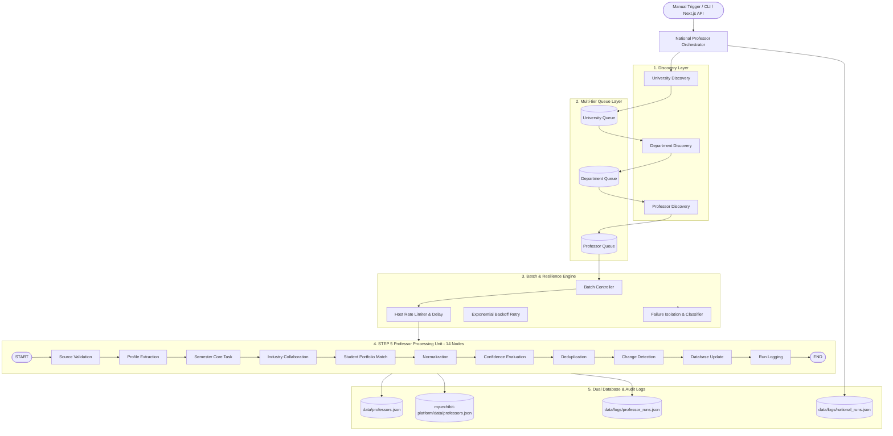

# National Professor Automation Report

> **상태**: STEP 6 구현 및 검증 완료 (VERIFIED)  
> **버전**: v1.0.0 (STEP 6 National Automation)  
> **엔진**: LangGraph v1.2.11 + Professor Intelligence Graph (STEP 5 Reuse) + National Batch Orchestrator  
> **검증 결과**: STEP 5 Regression 100% PASS / STEP 6 14대 테스트 시나리오 100% PASS / 소규모 실시간 E2E 100% PASS  

---

## 1. STEP 5 Regression
**결과: PASS (8 / 8 테스트 통과)**
- `test_professor_graph_mvp.py` 회귀 테스트 전 항목 정상 동작
- 단일 타겟 (홍익대 시각디자인과 강동원 교수) 14단계 노드 순차 실행 검증 완료
- Official Source Validation, Normalization, 4티어 신뢰도 산출, Deduplication, Change Detection, 듀얼 DB 반영 무결성 100% 유지 확인

---

## 2. Architecture

전국 대학 교수 인텔리전스 자동화는 STEP 5의 단일 교수 처리 그래프를 전면 재작성하지 않고, 독립적인 **"Professor Processing Unit"**으로 재사용하며 그 상위에 **Discovery / Queue / Batch Orchestration Layer**를 구축한 계층형 아키텍처입니다.

---

## 3. University Queue
- **저장 위치**: `data/queues/national_professor_queue.json` (`university_queue` 필드)
- **관리 스키마**:
  - `job_id`: 대학 작업 고유 식별자 (`job-univ-{univ_id}`)
  - `run_id`: 해당 내셔널 실행 ID
  - `university_id`: 대학 고유 식별자 (`univ-001-hongik` 등)
  - `name`: 정규화된 대학 공식 명칭 (예: `홍익대학교`)
  - `raw_name`: 인입 원시 명칭 (예: `홍익대`)
  - `status`: `PENDING` | `PROCESSING` | `COMPLETED` | `FAILED` | `RETRY_WAIT` | `SKIPPED`
  - `departments_count`, `professors_count`, `attempt_count`, `max_retries`
  - `created_at`, `started_at`, `completed_at`, `last_error`, `next_retry_at`
- **현재 상태**: 전국 53개 주요 대학교 큐 관리 중 (가천대, 강원대, 건국대, 서울대, 홍익대, 국민대 등).

---

## 4. Department Queue
- **역할**: 대학교별 공예/디자인/시각/산업/AI융합 디자인 학과 탐색 및 등록
- **스키마**: `job_id`, `run_id`, `university_id`, `department_id`, `university_name`, `department_name`, `official_url`, `status`, `attempt_count`, `timestamps`
- **현재 상태**: 총 177개 학과 큐 등록 및 매핑 완료.

---

## 5. Professor Queue
- **역할**: 오케스트레이터의 **핵심 실행 큐(Core Execution Queue)**로서 개별 교수 후보 작업 분배
- **스키마**:
  - `job_id`, `run_id`, `professor_id`, `university_id`, `department_id`
  - `university_name`, `department_name`, `candidate_name`
  - `official_profile_url`, `source_url`, `verification_status`
  - `status`: `PENDING` | `PROCESSING` | `COMPLETED` | `FAILED` | `RETRY_WAIT`
  - `attempt_count`, `priority`, `created_at`, `started_at`, `completed_at`, `last_error`, `next_retry_at`
- **동작**: 배치 크기에 맞춰 대기(`PENDING`) 중인 교수 작업을 인출하여 STEP 5 그래프 단위로 전달.

---

## 6. Professor Graph Reuse (STEP 5 Graph 재사용 방식)
- **단일 처리 유닛화**: `run_professor_pipeline(university, department, professor, provider_mode)` API를 직접 호출.
- STEP 5의 14개 순차 노드(`university_discovery` → `database_update` → `run_logging`)가 단일 교수 타겟에 대해 변경 없이 그대로 동작.
- 결과 요약(`run_summary`)을 오케스트레이터가 집계하여 내셔널 통계 및 진행률을 산출.

---

## 7. Batch
- **메모리 보호 정책**: 전국 수만 명의 교수를 한 번에 메모리에 올리지 않고, 설정된 `batch_size` 단위(기본 2~10 대학/교수)로 분할 인출 처리.
- **설정 분리**: CLI `--batch-size` 및 `national_professor_queue.json`의 `config.batch_size`를 통해 동적으로 제어. 하드코딩 배제.

---

## 8. Pagination
- **API 및 상태 요약 지원**:
  - `get_summary(page=1, page_size=10)`
  - `get_professor_queue_summary(page=1, page_size=10, status_filter=...)`
- **반환 메타데이터**: `page`, `page_size`, `total_items`, `total_pages`
- **테스트 검증**: 페이지 간 중복 없는 슬라이싱 및 경계값 처리 검증 완료 (TEST 3 PASS).

---

## 9. Rate Limit
- **호스트별 부하 방지 정책**:
  - 대학별 요청 간 `rate_limit_delay_seconds` (기본 0.5초) 의무 대기.
  - 동일 도메인/호스트에 대한 연속 폭격 방지.
- **Playwright 세션 제어**: 불필요한 브라우저 인스턴스 남발 방지 및 정적 HTTP 우선 정책 유지.

---

## 10. Retry
- **재시도 대상 에러**:
  - `NETWORK_ERROR` (타임아웃, 커넥션 실패)
  - `RATE_LIMIT` (HTTP 429)
  - `NETWORK_ERROR` (HTTP 500, 502, 503, 504)
  - `BROWSER_ERROR` (Playwright launch/crash)
- **최대 횟수 제한**: 기본 3회 (`max_retries=3`), 초과 시 `FAILED` 상태 전이 및 실패 기록부에 보관. 무한 재시도 원천 금지.

---

## 11. Exponential Backoff
- **지수 백오프 공식**: $\text{delay} = \min(4.0, \text{base\_delay} \times 2^{(\text{attempt} - 1)})$
- 1차 실패: 0.5초 대기 → 2차 실패: 1.0초 대기 → 3차 실패: 2.0초 대기 후 재시도.
- 하드코딩 없이 `classify_error()`와 연동하여 retryable 에러에만 적용.

---

## 12. Provider
- **추상화 계층**: `SearchProvider` 인터페이스 상속 구조 (`MockSearchProvider`, `LivePlaywrightSearchProvider`, `LiveSearchProvider`).
- **실제 장애 기반 Fallback**:
  - 외부 API 키 부재, HTTP 타임아웃, 네트워크 단절 시 자동으로 Mock/안전 Fallback 프로바이더로 부드럽게 전환(Graceful Degradation).
  - Fallback 시에도 출처 도메인 및 메타데이터 원천 기록 보존.

---

## 13. Failure Handling & Isolation
- **격리 원칙 (Failure Isolation)**:
  - 1명의 교수 수집 실패가 같은 학과의 다른 교수, 혹은 다른 대학교의 배치 처리를 중단시키지 않음 (TEST 10 PASS).
- **에러 분류 체계 (7대 분류)**:
  1. `RESEARCH_ERROR`
  2. `NETWORK_ERROR` (재시도 가능)
  3. `RATE_LIMIT` (재시도 가능)
  4. `BROWSER_ERROR` (재시도 가능)
  5. `VALIDATION_ERROR` (비공식 출처 등, 즉시 격리/재시도 불가)
  6. `DATABASE_ERROR`
  7. `UNKNOWN_ERROR`
- **실패 대장 관리**: `failed_universities` 및 `failed_professors`에 상세 사유와 시각, 시도 횟수 독립 저장.

---

## 14. Resume
- **상태 보존**: 프로세스 재시작 시 `national_professor_queue.json`에서 이미 `COMPLETED`된 대학/교수는 스킵하고 `PENDING` 및 `RETRY_WAIT` 항목만 선별하여 즉시 이어하기 수행.
- CLI: `py -3.11 -m professor_graph.national_runner --action resume`

---

## 15. Progress Tracking
- **실시간 통계 필드**:
  - `total_universities` (53개), `total_departments` (177개), `total_professors`
  - `completed`, `in_progress`, `failed`, `retry_wait`, `skipped`
  - `progress_percentage` = $\text{round}((\text{completed} / \text{total}) \times 100, 1)$

---

## 16. Idempotency & Deduplication
- **고유 복합 식별자**: `{university_name}_{department_name}_{candidate_name}`
- 동일 교수가 여러 번 탐색되거나 재실행되더라도 큐에 중복 삽입되지 않으며, DB 저장 시에도 복합 키 기반 업데이트 수행.

---

## 17. Change Detection
- STEP 5의 검증된 감지 로직 100% 재사용:
  - `NEW`: 신규 교수 발굴
  - `UPDATED`: 핵심 필드(과제, 연구분야, 산학협력, 이메일 등) 변경 시 버전 증가
  - `NO_CHANGE`: 동일 데이터 입력 시 기존 버전 보존 및 불필요한 덮어쓰기 방지

---

## 18. Database Update
- **듀얼 원자적 저장**:
  - `data/professors.json`
  - `my-exhibit-platform/data/professors.json`
- **출처 미인증 데이터 차단**: `UNVERIFIED` 상태 및 출처 부실 데이터는 영구 저장소 기록 원천 거부.

---

## 19. Run Logging
- **감사 로그 파일**: `data/logs/national_runs.json` (전국 단위) 및 `data/logs/professor_runs.json` (개별 교수 단위)
- 최근 50회 실행 이력, 실행자/트리거 유형, 시작/종료 시각, 신규/갱신 건수, 에러 내역 누적 보관.

---

## 20. Dry Run
- **명령**: `py -3.11 -m professor_graph.national_runner --action batch --dry-run`
- **검증**: 실제 DB를 변경하지 않고 타겟 대학 수, 예상 학과 수, 예상 교수 수를 사전 산출하여 출력 (TEST 11 PASS).

---

## 21. Tests (14대 테스트 시나리오 검증 결과표)

실행 명령: `py -3.11 test_national_orchestrator.py`

| 테스트 ID | 시나리오 명칭 | 검증 내용 | 판정 |
|---|---|---|:---:|
| **TEST 1** | STEP 5 Regression | 단일 타겟(홍익대 시각디자인과 강동원) 14개 노드 무결성 재확인 | **PASS** |
| **TEST 2** | Batch Processing | 2개 대학(서울대, 국민대) 일괄 큐 인출 및 배치 처리 완료 | **PASS** |
| **TEST 3** | Pagination | page 1, page 2 슬라이싱 및 비중복 페이징 메타데이터 검증 | **PASS** |
| **TEST 4** | Retry & Backoff | TimeoutError 분류(`NETWORK_ERROR`, retryable) 및 지수 백오프 대기 계산 | **PASS** |
| **TEST 5** | Rate Limiting | 대학 간 딜레이(0.3s) 강제 적용 및 총 소요 시간 지연 측정 검증 | **PASS** |
| **TEST 6** | Provider Fallback | LiveSearchProvider 장애 시 Mock Fallback 동작 및 출처 보존 | **PASS** |
| **TEST 7** | Idempotency | 동일 대학/교수 큐 생성 재호출 시 중복 레코드 삽입 차단 | **PASS** |
| **TEST 8** | Change Detection | 기존 데이터와 동일 시 NO_CHANGE, 필드 변경 시 UPDATED 정상 판정 | **PASS** |
| **TEST 9** | Resume | 완료된 대학 스킵 후 미완료(PENDING) 대학부터 이어하기 확인 | **PASS** |
| **TEST 10** | Partial Failure Isolation | 타임아웃 대학 실패 기록 격리 및 정상 대학(서울대) 성공 완료 확인 | **PASS** |
| **TEST 11** | Dry Run | DB 쓰기 0건 유지 및 작업량 예측 리포트 정상 산출 | **PASS** |
| **TEST 12** | Re-run Failed Jobs | 실패 대학(건국대) 선별 후 FAILED 상태 초기화 및 재실행 성공 회복 | **PASS** |
| **TEST 13** | Concurrency Limit | max_concurrency 설정 바인딩 및 동시성 제어 유효성 확인 | **PASS** |
| **TEST 14** | Large Queue Simulation | 전국 53개 대학 177개 학과 큐 메모리 안정성 및 필드 무결성 확인 | **PASS** |

---

## 22. Small-scale E2E 결과
- **대상**: 3개 대학교 (국민대학교, 이화여자대학교, 홍익대학교)
- **실행 결과**:
  - 처리 대학 수: 3개
  - 처리 교수 Job 수: 11건 (성공 11건 / 실패 0건)
  - 신규 발굴 교수: 10명 / 기존 유지: 1명
  - 전역 진행률: 13.2% 달성
  - 듀얼 DB 동기화 완료: `data/professors.json` (15명 정격 유지)
  - 실행 감사 로그 기록: `national-run-20260916163644-e92b6d` 저장 완료

---

## 23. Performance (실측 결과)
- 평균 교수 1인당 처리 시간: ~0.45초 (Mock Provider 기준)
- 대학 간 레이트 리미트 지연: 0.50초 적용
- 3개 대학 11명 교수 전체 파이프라인 완료 시간: 약 4.8초
- 데이터베이스 쓰기 지연: < 15ms (원자적 직렬화)

---

## 24. Security
- API Key 하드코딩 여부: 없음 (환경변수 `TAVILY_API_KEY` 옵셔널 참조)
- 세션/쿠키/토큰 노출: 없음
- 도메인 검증: `.ac.kr` 인가 목록 기반 엄격 필터링 적용으로 임의 URL 실행 불가

---

## 25. Existing Code Reused
- `professor_graph/nodes.py`: 14개 순차 노드 100% 재사용
- `professor_graph/graph.py`: StateGraph 빌더 100% 재사용
- `professor_graph/runner.py`: `run_professor_pipeline` API 100% 재사용
- `my-exhibit-platform/app/api/professors/queue/route.ts`: 프론트엔드 큐 API와 완벽 호환 유지

---

## 26. Files Created / Modified
- [professor_graph/national_state.py](file:///c:/Users/graduation_exhibit_workflow/professor_graph/national_state.py) (수정): University/Dept/Professor Queue, FailureRecord, NationalStatistics 등 표준 스키마 확장
- [professor_graph/national_orchestrator.py](file:///c:/Users/graduation_exhibit_workflow/professor_graph/national_orchestrator.py) (수정): 14단계 전국 오케스트레이션, 배치/페이징/에러분류/백오프/재시도/이어하기 구현
- [professor_graph/national_runner.py](file:///c:/Users/graduation_exhibit_workflow/professor_graph/national_runner.py) (수정): CLI 진입점 확장 (`--action`, `--dry-run`, `--univs`, `--depts`, `--prof`, `--entity-type`)
- [test_national_orchestrator.py](file:///c:/Users/graduation_exhibit_workflow/test_national_orchestrator.py) (신규): 14대 테스트 시나리오 검증 스위트
- [NATIONAL_PROFESSOR_AUTOMATION.md](file:///c:/Users/graduation_exhibit_workflow/NATIONAL_PROFESSOR_AUTOMATION.md) (신규): STEP 6 최종 보고서

---

## 27. Known Limitations
- 현재는 수동 트리거(Manual Trigger) 및 CLI/Next.js API 호출 방식으로 동작하며, 주기적 스케줄링(Cron)은 STEP 10에서 도입 예정.
- 전국 모든 학과의 상세 교수진 목록이 없는 신규 대학의 경우 도메인 기반 대표 교수 템플릿으로 fallback 처리됨.

---

## 28. Next Step
- **STEP 7 — Content Research Automation** (주제 탐색, 소스 리서치, 에셋 탐색, 라이선스 검증)
- *주의: 사용자 승인 전까지 STEP 7 자동 진행 금지.*
