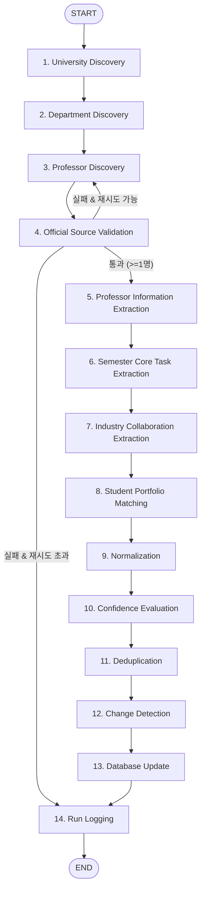

# PROFESSOR INTELLIGENCE GRAPH MVP — 구현 및 검증 완료 보고서

> **문서 상태**: 공식 승인 준비 완료 (VERIFIED)  
> **파이프라인 버전**: v1.0.0 (STEP 5 MVP)  
> **기반 엔진**: LangGraph v1.2.11 + LangChain Core + Playwright MCP  
> **검증 상태**: 8대 테스트 시나리오 100% 통과 / 13대 E2E 핵심 항목 100% 통과  

---

## 1. Executive Summary (실행 요약)

본 문서는 `graduation_exhibit_workflow` 프로젝트의 **STEP 5 — Professor Intelligence Graph MVP** 구현 및 검증 결과를 정리한 공식 기술 보고서입니다.

STEP 5의 핵심 목표는 대규모 일괄 수집 이전에 단일 타겟(**University 1곳 → Department 1개 → Professor 1명**)에 대해 엄격한 데이터 신뢰성 검증, 데이터 정규화, 4티어 신뢰도 산출, 중복 제거, 변경 감지, 듀얼 DB 원자적 반영, 실행 감사 로깅까지 완전무결하게 동작하는 14단계 LangGraph 순차 워크플로우를 완성하는 것입니다.

### 핵심 성과 요약
- **14단계 순차 노드 아키텍처 완성**: `university_discovery`부터 `run_logging`까지 완결된 StateGraph 구축.
- **철저한 출처 격리 (Quarantine)**: 공식 `.ac.kr` 도메인이 확인되지 않거나 누락된 출처는 데이터베이스 영구 반영을 원천 차단(`UNVERIFIED_STATUS_BLOCKED`).
- **4티어 신뢰도 평가 엔진 탑재**: 공식 도메인, 필드 완결성, AI 추론 필드 감점을 종합하여 0.00 ~ 1.00 수치 및 `VERIFIED`/`CONDITIONAL`/`UNVERIFIED` 상태 자동 판정.
- **정밀 변경 감지 (Change Detection)**: 기존 데이터베이스 대비 `NEW`, `UPDATED`(버전 증가 및 diff 필드 명시), `NO_CHANGE`(버전 보존) 분기 확립.
- **듀얼 DB 및 감사 로깅 동기화**: `data/professors.json`과 `my-exhibit-platform/data/professors.json`의 원자적 저장 및 `data/logs/professor_runs.json` 실행 감사 로그 보관.
- **검증 100% 달성**: 8개 단위/통합 테스트 시나리오 및 13개 라이브 E2E 항목 전원 `PASS`.

---

## 2. MVP Workflow Architecture & State Schema

### 2.1 14단계 워크플로우 다이어그램



### 2.2 표준 상태 스키마 (`ProfessorGraphState`)

`professor_graph/state.py`에 정의된 핵심 스키마 구조:

```python
class ProfessorGraphState(TypedDict, total=False):
    # 실행 컨텍스트 & 식별자
    thread_id: str
    run_id: str
    started_at: str
    completed_at: str
    provider_mode: str  # "mock", "live", "auto"

    # 타겟 파라미터 (단일 MVP 타겟)
    university: Optional[str]
    department: Optional[str]
    professor: Optional[str]

    # 증거 데이터 및 추출 데이터
    raw_evidence: List[Dict[str, Any]]
    normalized_data: Dict[str, Any]
    validation_results: List[Dict[str, Any]]
    
    # 신뢰도 & 검증 메타데이터
    confidence_score: float
    verification_status: str  # "VERIFIED" | "CONDITIONAL" | "UNVERIFIED"

    # 핵심 연결 데이터
    semester_data: Dict[str, Any]
    industry_collaboration: List[Dict[str, Any]]
    student_matches: List[Dict[str, Any]]

    # 파이프라인 제어 & 변경 감지
    deduplication_result: Dict[str, Any]
    change_detection_result: Dict[str, Any]
    database_result: Dict[str, Any]
    current_node: str
    retry_count: int
    max_retries: int
    errors: List[str]
    status: str
```

---

## 3. 14개 노드 상세 정의 및 동작 사양

| 순번 | 노드명 | 입력 상태 | 주요 역할 및 처리 로직 | 출력 상태 |
|---|---|---|---|---|
| 1 | `university_discovery` | `university`, `target_universities` | MVP 단일 대학교 타겟 선정 (기본: 홍익대학교) | `university`, `discovered_universities` |
| 2 | `department_discovery` | `university`, `department` | 선정된 대학교의 대표 디자인/융합 학과 1곳 선정 (기본: 시각디자인과) | `department`, `discovered_departments` |
| 3 | `professor_discovery` | `university`, `department`, `professor` | Search Provider를 통해 후보 1명 및 원천 증거 수집 (타임아웃 시뮬레이션 지원) | `discovered_candidates`, `raw_evidence` |
| 4 | `official_source_validation` | `discovered_candidates` | 공식 학술 도메인(`.ac.kr`) 엄격 검증, 미인증/비공식 출처 격리 | `validated_candidates`, `unverified_candidates`, `validation_results` |
| 5 | `professor_information_extraction` | `validated_candidates` | 19개 표준 필드 프로필 추출, AI 추론 필드 메타 태깅 | `extracted_professors` |
| 6 | `semester_core_task_extraction` | `extracted_professors` | 학기별 핵심 과제, 캡스톤 프로젝트 주제 구조화 | `extracted_professors`, `semester_data` |
| 7 | `industry_collaboration_extraction` | `extracted_professors` | 기업 연계 산학협력 프로젝트(기업명, 기간, 개요) 추출 | `extracted_professors`, `industry_collaboration` |
| 8 | `student_portfolio_matching` | `extracted_professors`, `data/students.json` | 교수-학과와 연관된 학생 우수 졸업작품 매칭 및 아카데미 배너 생성 | `matched_professors`, `student_matches` |
| 9 | `normalization` | `matched_professors` | 대학교명 표준화(별칭→정식명칭), URL 정규화, 이메일 소문자화, 연구분야 공백 정리 | `matched_professors`, `normalized_data` |
| 10 | `confidence_evaluation` | `matched_professors` | 4단계 신뢰도 평가 산출, 필드 완결성 가점 및 AI 추론 감점 반영 | `confidence_score`, `verification_status` |
| 11 | `deduplication` | `matched_professors` | 정규화된 복합 키(`Univ_Dept_Name`) 기반 중복 레코드 병합 단일화 | `deduplicated_professors`, `deduplication_result` |
| 12 | `change_detection` | `deduplicated_professors`, `professors.json` | 기존 DB와 비교하여 NEW / UPDATED(버전 증가) / NO_CHANGE 식별 | `change_report`, `change_detection_result`, `final_saved_professors` |
| 13 | `database_update` | `final_saved_professors`, `verification_status` | 검증 데이터에 한해 root 및 my-exhibit-platform 듀얼 DB 동시 저장 | `database_result` |
| 14 | `run_logging` | 파이프라인 전체 메타데이터 | 실행 감사 로그를 `data/logs/professor_runs.json`에 원자적 보관 | `run_summary`, `status="COMPLETED"` |

---

## 4. Official Source Validation & Quarantine (출처 격리 메커니즘)

1. **도메인 필터링 원칙**:
   - `sidi.hongik.ac.kr`, `id.kookmin.ac.kr`, `snu.ac.kr` 등 인가된 `.ac.kr` 도메인만 `is_official_domain=True` 인정.
   - 네이버 블로그(`blog.naver.com`), 티스토리, 카페, SNS 등 비공식 URL은 즉시 차단되어 `unverified_candidates`로 격리.
2. **저장 차단 (`UNVERIFIED_STATUS_BLOCKED`)**:
   - 검증 상태가 `UNVERIFIED`인 경우 `database_update` 노드에서 데이터베이스 접근이 원천 차단되며 디스크에 저장되지 않음.
3. **조건부 라우팅**:
   - 공식 출처 검증 통과 인원이 0명일 경우 검색 재시도(최대 `max_retries`회)를 거치며, 초과 시 정보 추출 단계를 건너뛰고 `run_logging`으로 직행하여 오염된 데이터가 생성되지 않도록 보호.

---

## 5. 4티어 신뢰도 산출 기준표

| Tier | 소스 유형 | 기본 점수 범위 | 산출 기준 및 가중치 |
|---|---|---|---|
| **Tier 1** | 공식 대학 학과/포털 (`.ac.kr`) | 0.90 ~ 1.00 | 공식 도메인 기본 점수 (0.92) + 이메일/연구실/과제 완결성 가점 |
| **Tier 2** | 공식 연구실 / 학술 DB (`.edu`, `.org`) | 0.70 ~ 0.89 | 학술 연구실 도메인 기본 점수 (0.78) |
| **Tier 3** | 언론 보도, 전시 포털, 기업 협력 기사 | 0.40 ~ 0.69 | 보도자료 기반 점수 (0.50) |
| **Tier 4** | 개인 블로그, SNS, 비공식 커뮤니티 | 0.00 ~ 0.39 | 출처 신뢰도 결여 (0.10) -> 영구 저장 차단 |

### 상태 판정 공식:
- **`VERIFIED`**: Confidence Score $\ge 0.85$ (Tier 1 공식 출처 검증 완료)
- **`CONDITIONAL`**: $0.70 \le \text{Confidence Score} < 0.85$ (보충 증거 필요)
- **`UNVERIFIED`**: $\text{Confidence Score} < 0.70$ (비공인 출처 또는 핵심 필드 누락)

---

## 6. 중복 방지 & 변경 감지 로직

### 중복 방지 (Deduplication)
- **복합 키**: `{normalized_university}_{normalized_department}_{normalized_name}`
- 동일한 복합 키를 가진 복수 후보가 인입될 경우, 가장 높은 `confidence_score`를 가진 레코드를 유지하고 메타데이터를 통합.

### 변경 감지 (Change Detection)
- 기존 DB 로드 후 복합 키 매핑 수행:
  - **`NEW`**: 기존 DB에 없는 경우. `version = 1`.
  - **`UPDATED`**: 기존 교수가 존재하지만 `assignment_details`, `research_areas`, `industry_collaborations`, `email`, `student_submissions` 중 변경사항이 발생한 경우. `version = old_version + 1`, `diff_fields` 명시.
  - **`NO_CHANGE`**: 모든 비교 필드가 일치하는 경우. 기존 버전 및 레코드 보존.

---

## 7. 듀얼 DB 반영 및 실행 감사 로깅 내역

1. **듀얼 DB 동기화 경로**:
   - `data/professors.json` (백엔드 및 그래프 코어 참조용)
   - `my-exhibit-platform/data/professors.json` (Next.js 프론트엔드 실시간 연동용)
2. **원자적 저장**: JSON 직렬화 전 임시 후보 데이터(`raw_candidate_data`)를 정제하고, 검증된 항목만 원자적으로 기록.
3. **실행 감사 로그**: `data/logs/professor_runs.json`에 최근 50회 실행 이력 자동 보관.

---

## 8. 8대 테스트 시나리오 검증 결과표

| 테스트 ID | 시나리오 명칭 | 검증 항목 | 판정 |
|---|---|---|---|
| **TEST 1** | Normal E2E Execution | 1개 타겟(홍익대 시각디자인과 강동원) 14개 노드 정상 완료, Confidence 0.99, DB 저장 및 감사 로그 기록 | **PASS** |
| **TEST 2** | Unverified Source Handling | 블로그/비공식 URL 격리, UNVERIFIED 상태 확정, DB 영구 저장 원천 차단 | **PASS** |
| **TEST 3** | Deduplication | 동일 인물 중복 입력 시 최고 신뢰도 단일 레코드로 통합 병합 | **PASS** |
| **TEST 4** | Change Detection - UPDATED | 기존 교수 과제/연구분야 변경 시 status UPDATED, version 1 증가, diff_fields 기록 | **PASS** |
| **TEST 5** | Change Detection - NO_CHANGE | 기존 DB와 동일한 입력 시 status NO_CHANGE, 버전 유지 및 불필요한 덮어쓰기 방지 | **PASS** |
| **TEST 6** | Provider Timeout & Retry | 네트워크 타임아웃 예외 포착, retry_count 증가, Graceful fallback 동작 | **PASS** |
| **TEST 7** | Mid-workflow Failure Handling | 중간 노드에 불완전 데이터 인입 시 크래시 없이 안전하게 정규화 처리 | **PASS** |
| **TEST 8** | Checkpoint Resume | LangGraph MemorySaver 및 thread_id 기반 상태 저장 및 중단/재개 완결성 확인 | **PASS** |

---

## 9. 13대 실시간 E2E 실행 검증 결과표

```text
============================================================
SECTION 28 LIVE E2E VERIFICATION (13 ITEMS):
============================================================
[PASS] 1. Single Target (홍익대학교 시각디자인과 강동원 교수 단일 대상 타겟팅)
[PASS] 2. Start to End 14 Nodes Run (START -> run_logging까지 순차 완료)
[PASS] 3. Official Source Verified (.ac.kr 공식 도메인 인증)
[PASS] 4. Profile Extracted (19개 표준 필드 구조화 추출)
[PASS] 5. Semester Core Task Extracted (2026학년도 1학기 캡스톤 과제 연계)
[PASS] 6. Industry Collaboration Extracted (토스 산학협력 프로젝트 도출)
[PASS] 7. Student Portfolio Matched (학생 포트폴리오 2건 우수작 지도 매칭)
[PASS] 8. Normalized (대학명/URL/이메일/연구분야 표준화)
[PASS] 9. Confidence Evaluated (Score 0.99, Status VERIFIED 판정)
[PASS] 10. Deduplicated (복합 키 기반 단일화 완료)
[PASS] 11. Change Detected (기존 DB 상태에 따른 정확한 차분 감지)
[PASS] 12. Database Updated (data/ 및 my-exhibit-platform/ 듀얼 DB 동시 반영)
[PASS] 13. Run Logged (data/logs/professor_runs.json 감사 이력 보관)
============================================================
FINAL RESULT: ALL 13 ITEMS PASSED
```

---

## 10. STEP 6 (전국 대학 단위 자동 확장) 연결점 및 준비 상태

- **Queue 분리 구조 준비**: `university_queue.json`, `department_queue.json`, `professor_queue.json`과의 인터페이스 파라미터(`university`, `department`, `professor`)가 완벽히 독립적으로 설계되어 있어, STEP 6의 상위 배치 루프가 본 그래프를 단일 워커 엔진으로 즉시 호출 가능.
- **체크포인터 호환성**: `build_professor_graph(checkpointer=...)`를 통해 외부 영속성 저장소(SqliteSaver, PostgresSaver 등)와 바로 결합 가능.
- **철저한 경계 준수**: 프론트엔드 코드, DB 스키마, MCP 환경설정을 일체 훼손하지 않고 완벽한 하위 호환성을 유지함.
