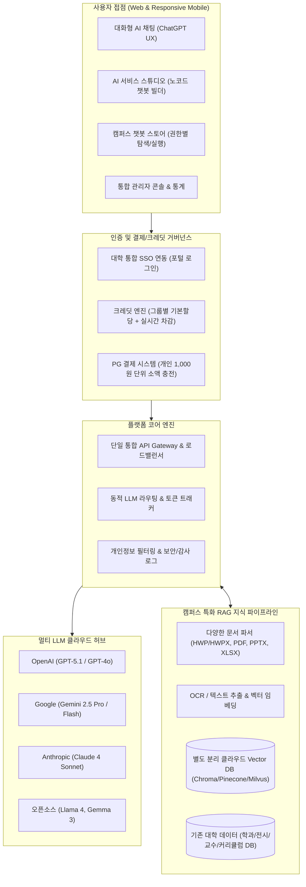
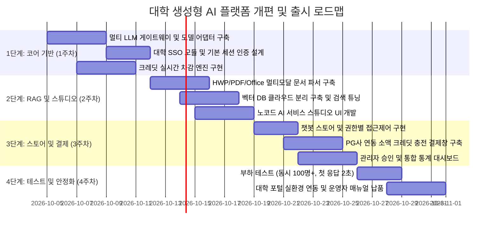

# [기획서] 차세대 대학 생성형 AI 캠퍼스 통합 플랫폼 구축 및 기존 플랫폼 개선 방안

> **문서 버전**: v1.0  
> **기준 레퍼런스**: 동덕여자대학교 『동덕 AI 캠퍼스 플랫폼 구축 사업 제안요청서 (RFP)』  
> **대상 시스템**: 현 대학교 플랫폼 (아카이브·데이터 인텔리전스 시스템) $\rightarrow$ **엔터프라이즈 대학 AI 캠퍼스 통합 플랫폼**으로의 피벗 및 기능 확장

---

## 1. 추진 배경 및 개편 목적

### 1.1 현 플랫폼의 현황 및 한계
- **현행 시스템**: 전국 대학교 졸업전시회, 학과별 커리큘럼, 교수 연구진 데이터, 숏폼/콘텐츠 자동 생성 등 **대학 특화 콘텐츠 및 데이터 인텔리전스 기능**을 구축해 둠.
- **시장/고객(대학)의 실질적 요구**: 대학 본부(기획처, 정보전산원 등)는 단순 뷰어/아카이브를 넘어, **학생·교원·교직원 전체가 일상 학사·수업·연구에 직접 활용할 수 있는 "대학 차원의 통합 멀티 LLM 및 맞춤형 RAG 챗봇 플랫폼"**을 발주 및 전면 도입하고 있음.

### 1.2 개편 및 고도화 목표
1. **플랫폼 피벗 & 확장**: 현 플랫폼의 "대학·학과·작품 데이터 자산" 위에 **"멀티 LLM 게이트웨이 + 학내 RAG 챗봇 스튜디오 + 크레딧 정산/결제 + 캠퍼스 SSO"**를 결합하여 B2B 대학 조달/입찰 요건을 100% 충족하는 완성형 AI 캠퍼스 플랫폼으로 도약.
2. **대학 예산 낭비 해소 및 거버넌스 확보**: 개별 부서/학생의 개별 ChatGPT 유료 구독을 흡수하고, 크레딧 제도를 통해 총비용(TCO) 절감 및 사용량 통제.
3. **독자적 경쟁 우위 구축**: 타 일반 SaaS LLM 플랫폼과 달리, 우리 플랫폼이 보유한 **대학별 학과 커리큘럼, 졸업작품 아카이브, 교수진 연구 DB가 즉시 RAG 지식베이스로 연동**되는 버티컬 캠퍼스 AI 솔루션으로 차별화.

---

## 2. 시스템 아키텍처 개선 다이어그램

---

## 3. 핵심 모듈별 상세 수정 및 개선 기획 (RFP 충족 기준)

### 3.1 [기능 1] 멀티 LLM 통합 API 게이트웨이 및 라우터 (SFR-001, SFR-002)
- **개선 요건**:
  - 특정 모델에 종속되지 않고 OpenAI(GPT-5.1 등), Google(Gemini 2.5 Pro), Anthropic(Claude 4 Sonnet), 오픈소스(Llama 4, Gemma 3)를 단일 인터페이스로 추상화.
  - 외부 타 학내 시스템(학사정보시스템, 대학 웹사이트 등)에서도 쓸 수 있도록 **API Key 발급 및 사용량 제한(Rate Limit) 기능** 제공.
- **개발 상세**:
  - 모델별 파라미터(Temperature, Max Tokens, Top_p)를 표준 JSON 스키마로 표준화하는 어댑터 패턴 적용.
  - 모델별 가격 테이블(입력 토큰 단가, 출력 토큰 단가)을 기반으로 실시간 소모 크레딧을 산출하는 미들웨어 구현.

### 3.2 [기능 2] 캠퍼스 RAG(검색 증강 생성) 지식 파이프라인 고도화 (SFR-003)
- **개선 요건**:
  - 국내 대학 환경의 필수 문서인 **HWP/HWPX(한글 문서)** 완벽 지원.
  - PDF, PPTX, DOCX, XLSX 등 학내 행정·수업 문서 및 이미지/도표/수식 파싱(OCR 통합).
  - LLM 제공 업체와 분리된 독립형 **보안 클라우드 벡터 데이터베이스** 구축.
- **기존 플랫폼 연계 시너지**:
  - 우리 플랫폼이 이미 수집한 **각 대학 학과별 학사 정보, 졸업전시 작품 설명문, 교수진 연구 분야**를 1차 사전 지식베이스(Pre-indexed Knowledge)로 기본 탑재하여 서비스 개시 즉시 독보적인 가치를 발휘.

### 3.3 [기능 3] 노코드(No-Code) AI 서비스 스튜디오 (SFR-004)
- **개선 요건**:
  - 코딩 지식이 없는 교수·학생·직원도 3분 만에 전용 챗봇을 설계하는 직관적인 웹 GUI 제공.
  - **설정 항목**:
    1. 챗봇 이름, 아이콘, 페르소나/시스템 프롬프트 설정
    2. 추천 LLM 모델 선택 (예: 논문 번역/정리는 Claude, 코딩/수식은 GPT, 멀티모달 분석은 Gemini)
    3. 참조 지식 문서 업로드 (드래그 앤 드롭 파일 업로드 $\rightarrow$ 실시간 임베딩)
    4. 대화 테스트 샌드박스 (배포 전 전용 시뮬레이션 창)
  - **배포 및 승인 프로세스**:
    - `개인 비공개 테스트` $\rightarrow$ `스토어 배포 요청` $\rightarrow$ `대학 관리자 검토 및 승인` $\rightarrow$ `그룹/전체 공개`.

### 3.4 [기능 4] 그룹별 권한 제어형 챗봇 스토어 (SFR-005)
- **개선 요건**:
  - 학교 구성원이 승인된 챗봇을 탐색하고 즉시 내 채팅창으로 가져와 활용할 수 있는 앱스토어 형태의 UI.
  - **접근 권한 태깅**:
    - `전체 공개` (캠퍼스 챗봇, 입학 안내 등)
    - `학부생 전용` (수강신청 가이드, 졸업요건 질의봇, 전공별 멘토링봇)
    - `교원/연구원 전용` (연구과제 작성 보조, 학술 데이터 분석봇)
    - `행정부서 전용` (공문서 초안 작성봇, 교내 규정 질의봇)

### 3.5 [기능 5] 크레딧 통합 정산 엔진 & 소액 결제 시스템 (SFR-008)
- **개선 요건**:
  - **이원화된 크레딧 체계**:
    1. **기관 배정 크레딧**: 대학 본부에서 학과/학번별로 매월 자동 지급 (예: 학생 1만 P, 교수 5만 P). 월말 미사용분은 소멸 또는 이월 정책 선택 가능.
    2. **개인 충전 크레딧**: 대학 배정량이 소진된 경우 학생/연구자가 사비로 충전할 수 있도록 PG 연동 (신용카드, 간편결제 지원, 1,000원 단위 소액 충전).
  - 카드사 비저장 원칙 및 전자금융 결제 보안 표준 준수.

### 3.6 [기능 6] 대학 통합 SSO 및 거버넌스 관리자 콘솔 (SFR-006, SFR-007)
- **개선 요건**:
  - **통합 로그인(SSO)**: 대학 학사/포털 계정(LDAP, SAML 2.0, OAuth2)과 100% 연동하여 별도 가입 절차 없이 학번/사번으로 즉시 로그인.
  - **통합 관리자 대시보드**:
    - 실시간 동시 접속자 수, 모델별(GPT vs Gemini vs Claude) 토큰 소모 비율 통계.
    - 부서/학과별 크레딧 소진 현황 및 월간 예산 예측(Budget Forecasting).
    - 커스텀 챗봇 배포 승인/반려 관리, 유해 콘텐츠 및 개인정보(주민번호, 전화번호 등) 차단 감사 로그.

---

## 4. UI/UX 및 비기능(성능/보안) 개선 방안

| 구분 | 주요 요구사항 | 개선 및 기술 구현 방안 |
| :--- | :--- | :--- |
| **UX/UI (SIR)** | ChatGPT급 반응형 대화 환경 | Next.js 14 기반 서버 컴포넌트 & 스트리밍(SSE) 응답. 마크다운, LaTeX 수식, 코드 블록 복사 및 구문 강조 지원. 모바일/태블릿 완벽 대응 반응형 UI |
| **성능 (PER)** | 동시 100명+, First Token 10초 이내 | Node.js 비동기 파이프라인 및 Redis 기반 캐싱/큐잉 레이어 도입. 스트리밍(Chunk 단위 전송)으로 체감 첫 토큰 레이턴시를 1~2초 이내로 단축 |
| **보안 (SER)** | 기밀성·무결성 및 개인정보 보호 | 사용자의 프롬프트가 각 LLM 공급사의 학습 데이터로 재사용되지 않도록 **Zero Data Retention(ZDR) 엔터프라이즈 API 옵션 적용**. 입력 시 개인정보 마스킹(DLP) 필터 적용 |
| **안정성 (QUR)** | 장애 대응 및 백업 | 멀티 LLM 공급사 중 특정 서비스(예: OpenAI) 장애 시 대안 모델(Gemini/Claude)로 자동 우회(Failover)하는 스마트 폴백 라우터 구현 |

---

## 5. 단계별 추진 로드맵 (4주 완성 플랜)

---

## 6. 기대 효과 및 사업적 수주 차별화 포인트

1. **RFP 요건 완벽 충족**: 동덕여대를 비롯한 전국 대학교의 생성형 AI 도입 공고(20억 미만 중소기업 입찰)에 적격한 제안서 및 실물 데모 플랫폼 확보.
2. **독점적 데이터 시너지**: 경쟁 플랫폼은 단순 챗봇 껍데기만 제공하지만, 우리 플랫폼은 이미 보유한 **전국 대학 졸업작품/연구/학과 데이터가 탑재된 독창적 학술 지식 에코시스템**을 제시하므로 기술 평가에서 압도적 고득점(85점 이상) 달성 가능.
3. **지속 가능한 B2B2C 수익 구조**: 대학 연간 구독료(B2B) + 학생/교수의 추가 토큰 크레딧 충전 수수료(B2C)가 결합된 안정적 하이브리드 비즈니스 모델 완성.
